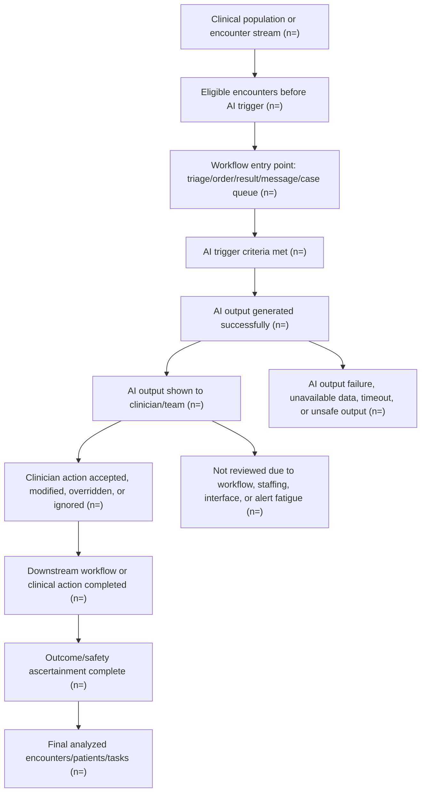

# AI Healthcare And ICAML-Style Study Design

Use this reference for AI healthcare studies whose primary question is clinical implementation, workflow impact, quality improvement, triage, CDSS, AI-assisted diagnosis, alerting, care escalation, or human-AI team performance.

## Positioning

Do not force every AI healthcare study into TRIPOD+AI, CONSORT-AI, or STARD-AI.

- Use TRIPOD+AI when the main contribution is prediction-model development, validation, calibration, or prognostic/diagnostic model reporting.
- Use STARD-AI when the main contribution is diagnostic accuracy against a reference standard.
- Use CONSORT-AI or SPIRIT-AI when the main contribution is a randomized AI intervention trial or protocol.
- Use DECIDE-AI when the main contribution is early-stage clinical evaluation of an AI decision-support system.
- Use SQUIRE when the main contribution is quality improvement.
- Use STROBE/RECORD when the evaluation is observational or RWE using routinely collected data.
- Use ICAML-style framing when the study evaluates how AI changes clinical workflow, operational decisions, triage, clinician behavior, quality, safety, timeliness, or implementation outcomes.

If the user specifies ICAML, treat ICAML as the controlling local framework for AI clinical implementation and workflow evaluation, then cross-map to DECIDE-AI, SQUIRE, STROBE/RECORD, CONSORT-AI, STARD-AI, or TRIPOD+AI only when those frameworks match the study question.

Before applying any AI guideline, run `study-intent-triage.md`. “AI study” is a technology label, not a design. A workflow intervention may be an ITS/CITS, DiD, stepped-wedge cluster RCT, or before-after study; a diagnostic AI study may be STARD-AI; a prediction model may be TRIPOD+AI; an early live CDSS evaluation may add DECIDE-AI.

## Common AI Healthcare Study Types

| Study type | Primary question | Typical design | Table 1/flowchart focus |
| --- | --- | --- | --- |
| AI clinical quality improvement | Does AI improve care quality, safety, adherence, timeliness, or resource use? | QI, interrupted time series, stepped wedge, pre-post, cluster trial, pragmatic trial | Sites, clinicians, eligible encounters, baseline quality metrics, workflow exposure |
| Workflow optimization | Does AI reduce workload, turnaround time, bottlenecks, or missed tasks? | Observational workflow study, time-motion study, pre-post, ITS, A/B deployment | Encounter/task volume, workflow stage, staff role, queue state, time stamps |
| AI triage | Does AI prioritize patients/cases safely and efficiently? | Prospective deployment, silent trial, reader/clinician-in-the-loop study, diagnostic or operational evaluation | Triage-eligible encounters, AI trigger, urgency strata, clinician review, reference/adjudication |
| CDSS | Does AI-assisted decision support change decisions, actions, outcomes, or safety? | DECIDE-AI early evaluation, pragmatic trial, stepped wedge, cluster trial, RWE | Alert recipients, recommendation exposure, acceptance/override, action taken, downstream outcome |
| AI-assisted diagnosis | Does AI improve clinician diagnostic performance or workflow? | Reader study, prospective paired design, diagnostic accuracy, RCT, deployment study | Patients/images/cases, reader experience, AI-visible vs AI-hidden phase, reference standard |
| LLM or generative AI clinical tool | Does generated output improve documentation, triage, summarization, handoff, or decision support? | Human evaluation, prospective deployment, randomized workflow study, implementation study | Input source, prompt/workflow context, reviewer role, output use, correction/override, safety review |

## LLM Clinical Quality-Control Deployment

For a proposal comparing LLM-agent quality control and adverse-event alerts with historical workflow:

- Ask rollout structure first after confirming the intervention-effect aim.
- Fixed-date deployment with repeated pre/post observations: ITS.
- Add a comparable concurrent untreated series: controlled ITS.
- Nonrandom staggered deployment: DiD/event study if assumptions are defensible.
- Randomized staggered deployment: stepped-wedge cluster RCT.
- Only one pre and one post aggregate: before-after study, not ITS.

Reporting overlays commonly include SQUIRE 2.0, TREND, RECORD, and DECIDE-AI. Bias and analysis layers remain ROBINS-I plus segmented regression/EPOC criteria for nonrandomized ITS/CITS. PSM cannot control secular trend by itself.

## ICAML-Style Flowchart

Use for clinical AI implementation and workflow evaluation.

Flowchart requirements:

- Separate patient-level, encounter-level, task-level, alert-level, message-level, and clinician-level denominators.
- Show when AI is silent, visible, advisory, interruptive, autonomous, or human-in-the-loop.
- Show model output failures, missing inputs, interface failures, and safety-screen exclusions.
- Show clinician review, acceptance, override, modification, and non-review.
- Show downstream action and outcome ascertainment.
- Reconcile final analyzed units with Table 1.

## Table 1 For AI Healthcare Workflow Studies

Columns depend on design:

- Pre-AI versus post-AI periods.
- AI-exposed versus unexposed encounters.
- AI-recommended versus AI-not-recommended cases.
- Clinician accepted versus overridden recommendations.
- Intervention versus control sites or clusters.
- Silent-mode versus live-mode deployment.
- Human-only versus human+AI reading/triage.

Core row blocks:

- Patient or encounter demographics: age, sex, race/ethnicity, language, insurance, deprivation index when relevant.
- Clinical baseline: disease severity, comorbidities, prior utilization, acuity, setting, referral source.
- Workflow context: site, department, queue, shift, weekday/weekend, staffing, baseline volume, baseline turnaround time.
- AI input availability: structured data completeness, note/image/lab availability, time from data capture to AI inference.
- AI exposure: trigger criteria, model version, threshold, score category, output type, explanation availability.
- Human-AI interaction: clinician role, experience, alert visibility, acceptance, override, action latency.
- Safety/fairness strata: underserved populations, language, race/ethnicity, sex, age, site, device, payer, care setting.
- Outcome context: follow-up availability, adjudication completeness, safety review status.

Avoid:

- Mixing patient-level and alert-level percentages without clear denominators.
- Treating AI-exposed encounters as comparable to unexposed encounters when exposure depends on workflow availability or clinician behavior.
- Reporting only model performance while ignoring adoption, override, workflow failure, and safety events.

## Bias And Threat Model

Evaluate:

- Selection bias: AI-triggered cases may differ from non-triggered cases.
- Workflow confounding: staffing, shift, site, case mix, and temporal trends can drive apparent AI effect.
- Automation bias: clinicians may over-rely on incorrect AI outputs.
- Alert fatigue: non-review and override patterns may change over time.
- Contamination: clinicians in control periods or sites may learn from AI exposure.
- Secular trend: pre-post designs may capture unrelated quality initiatives or seasonal changes.
- Data drift: model inputs and case mix may change after deployment.
- Fairness drift: performance or adoption may differ across demographic and clinical strata.
- Verification bias: only AI-flagged or clinician-reviewed cases may receive outcome adjudication.
- Reference/adjudication bias: human reviewers may see AI outputs unless blinded.

## Endpoints

Clinical quality:

- Guideline-concordant care, diagnostic yield, treatment delay, missed diagnosis, escalation, adverse events, mortality, readmission, length of stay.

Workflow:

- Turnaround time, queue time, time to review, time to action, number of clicks/tasks, workload, throughput, staffing load, handoff quality.

Triage/CDSS:

- Sensitivity for urgent cases, false-negative safety events, PPV, NPV, override rate, acceptance rate, time-to-escalation.

Human-AI team:

- Accuracy with and without AI, calibration of clinician trust, acceptance, override correctness, inter-reader agreement, automation bias events.

Implementation:

- Reach, adoption, fidelity, usability, acceptability, feasibility, sustainability, equity, maintenance burden.

## Sensitivity Analyses

Use as appropriate:

- Silent-mode versus live-mode comparison.
- Pre-post with interrupted time-series adjustment.
- Alternative thresholds and alerting policies.
- Accepted-only versus intention-to-expose AI analyses.
- Clinician override analysis and override-correctness adjudication.
- Site, shift, clinician role, language, race/ethnicity, sex, age, device, and acuity subgroup analysis.
- Difference-in-differences or stepped-wedge robustness if deployment is staggered.
- Negative control outcomes or tasks when available.
- Excluding ramp-up period after deployment.
- Model version sensitivity and drift analysis.
- Safety event adjudication blinded to AI exposure where possible.

## Reporting Output

For ICAML-style AI healthcare studies, produce:

1. Study question and AI workflow role.
2. Guideline cross-map: ICAML plus DECIDE-AI/SQUIRE/STROBE/RECORD/CONSORT-AI/STARD-AI/TRIPOD+AI only when relevant.
3. Unit of analysis and denominator hierarchy.
4. AI workflow flowchart.
5. Table 1 shell with clinical, workflow, AI exposure, and fairness blocks.
6. Endpoint hierarchy: clinical quality, workflow, safety, adoption, fairness.
7. Bias and threat-model checklist.
8. Sensitivity-analysis matrix.
9. Caption and footnote templates.
