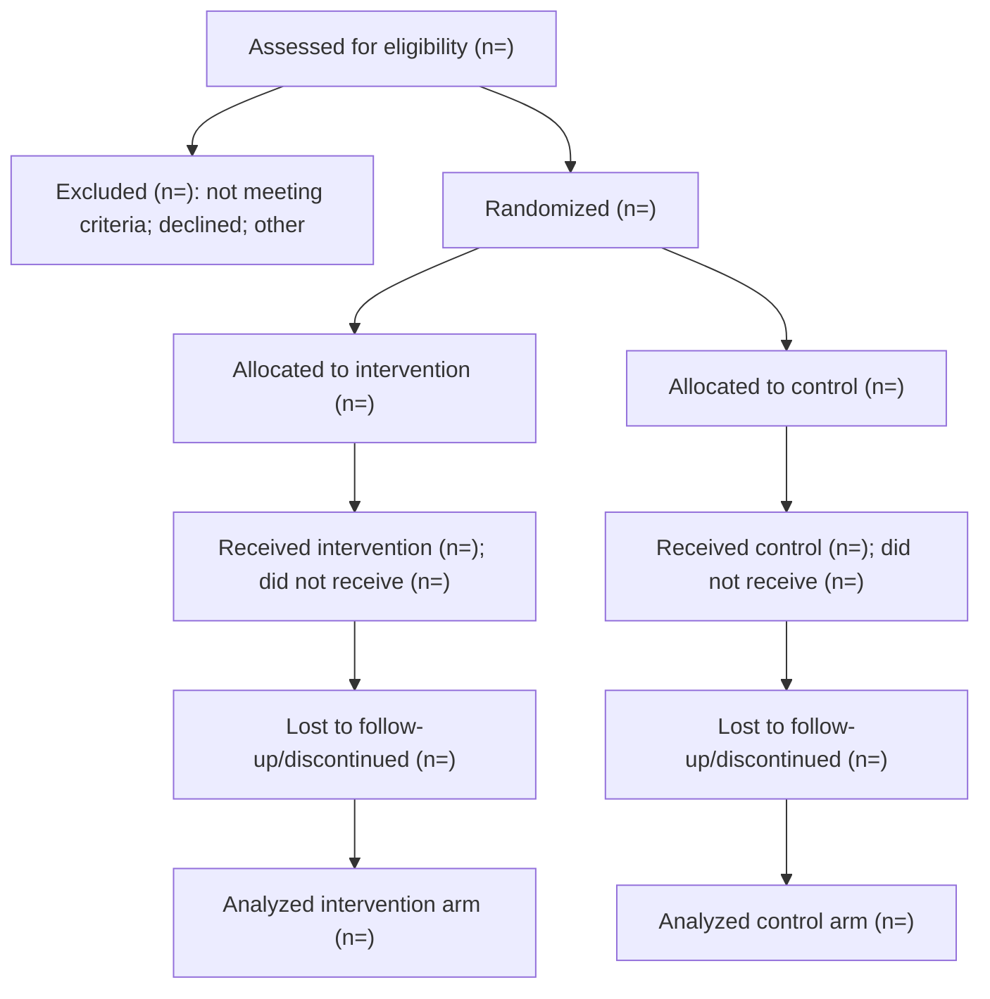
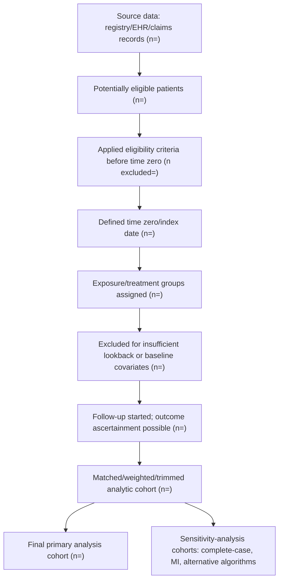
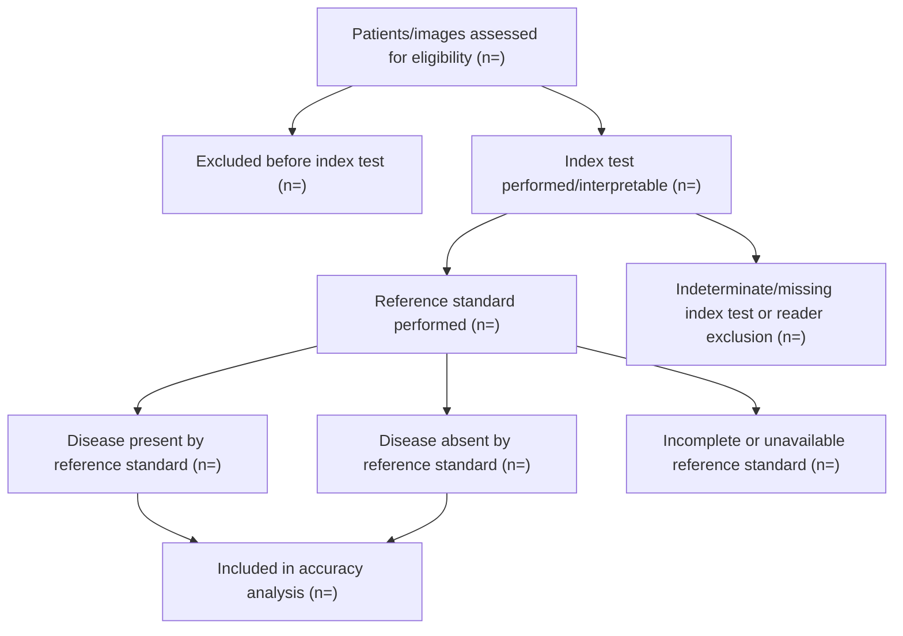
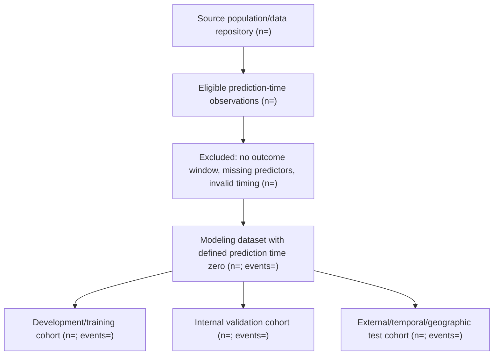
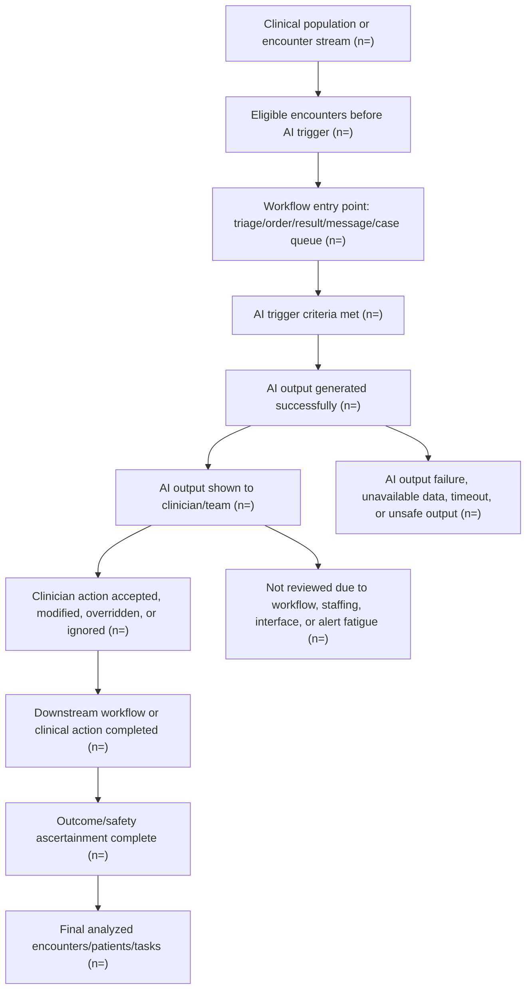

# Flowchart Design For Table 1 And Methods Reporting

Use this reference to design participant, cohort, dataset, and attrition flowcharts. Build the flowchart before locking Table 1 denominators.

## Universal Flowchart Rules

- Use the PRISMA/CONSORT visual grammar even outside evidence synthesis: a vertical main cohort, connected side boxes for exclusions, explicit group branches, rejoining analysis sets, and a figure caption. Call the figure PRISMA only for systematic/scoping reviews; label other figures by their applicable standard (CONSORT, STARD, STROBE/RECORD, TRIPOD+AI, ICAML/DECIDE-AI, or SQUIRE).
- Render the HTML output as a real connected figure, not a numbered list of analysis steps.
- Start with the broadest source population or data source.
- Preserve denominators at each transition.
- Attach every exclusion to timing: before time zero, at eligibility, at exposure assignment, during matching/weighting, during follow-up, at outcome ascertainment, or at final analysis.
- Separate clinical exclusions from data-quality exclusions.
- Keep missing-data exclusions visible even when multiple imputation is used.
- Reconcile final analytic n with Table 1 column n.
- Add a bias warning when attrition occurs after exposure assignment, after outcome measurement availability, or because of variables related to exposure and outcome.
- Use `n = pending` for protocol placeholders. Never invent enrollment counts. Replace pending values from `flow_counts` only after reconciling source data.

## Structured HTML Flow Inputs

Use `flow_counts` for node denominators and `flow_exclusions` for reason lists. Keep stable machine-readable keys so later data updates redraw the figure without editing HTML.

```json
{
  "flow_counts": {
    "source_population": 1200,
    "excluded_before_eligibility": 84,
    "eligible_at_time_zero": 1116,
    "primary_analysis": 1032
  },
  "flow_exclusions": {
    "excluded_before_eligibility": [
      "Outside the prespecified clinical population (n=40)",
      "Duplicate or invalid record (n=24)",
      "No linkable outcome record (n=20)"
    ]
  }
}
```

Require every parent count to reconcile with retained and excluded child counts. Where the unit changes, label each denominator explicitly (for example, technologists, periods, examinations, patients, images, lesions, readers, records, reports, or studies).

## CONSORT RCT Flowchart

Use for randomized trials and trial protocols.

Required structure:



Table 1 link:

- Use randomized population for intention-to-treat baseline Table 1 unless the SAP defines a different set.
- Do not use baseline p values to judge randomization.
- If modified ITT, safety, or per-protocol sets differ, footnote the set and consider a supplementary comparison.

## STROBE/RECORD RWE Attrition Flowchart

Use for EHR, claims, registry, pragmatic observational, target-trial emulation, and pharmacoepidemiologic studies.

Required structure:



Design checks:

- Define time zero before observing follow-up outcomes to avoid immortal time bias.
- Define lookback windows before exposure assignment whenever possible.
- Avoid excluding patients because of future data availability unless the bias implications are acknowledged.
- For RECORD, describe codes, linkage, database coverage, data cleaning, and access restrictions in Methods or supplement.
- For target-trial emulation, align eligibility, treatment strategies, assignment, follow-up, outcome, causal contrast, and analysis with the emulated trial protocol.

Bias warnings:

- Selection bias: exclusions after treatment/exposure assignment can create non-comparable groups.
- Depletion of susceptibles: excluding early events after index can distort causal estimates.
- Missingness bias: complete-case attrition can change covariate distribution and treatment prevalence.
- Surveillance bias: differential visit frequency or testing intensity can affect outcome ascertainment.

## STARD/Radiology Diagnostic Accuracy Flowchart

Use for diagnostic accuracy, imaging, pathology, AI diagnostic, and reader-study manuscripts.

One-gate design:

- Consecutive or random sample of clinically suspected patients from one care pathway.
- Lower risk of spectrum bias than a two-gate case-control design when the clinical population is realistic.

Two-gate design:

- Cases and controls sampled from different sources.
- Higher risk of spectrum bias, inflated accuracy, and applicability concerns. Require explicit justification.

Required structure:



Bias checks:

- Spectrum bias: include disease severity, clinical setting, referral source, and alternative diagnoses in Table 1.
- Verification bias: show who did and did not receive the reference standard.
- Reference-standard bias: define the standard and whether it is independent of the index test.
- Reader bias: report blinding, reader expertise, adjudication, and repeated reads.
- Device/site bias: report scanner/vendor/protocol, acquisition setting, and site distribution.

## TRIPOD+AI Prediction And Survival Flowchart

Use for prognostic/diagnostic prediction models, survival prediction, and medical AI models.

Required structure:



Table 1 link:

- Show predictors and event counts by development, validation, and test cohort.
- For time-to-event outcomes, report follow-up duration, events, censoring, and whether Cox, competing risk, landmarking, or time-dependent methods are used.
- Include C-index, calibration, and decision-curve expectations in the analysis plan, not in Table 1 unless summarizing validation cohorts.

## ICAML-Style AI Healthcare Workflow Flowchart

Use for AI clinical quality improvement, workflow optimization, triage, CDSS, AI-assisted diagnosis, alerting, care escalation, and deployment evaluation when the primary question is clinical implementation or human-AI workflow impact.



Design checks:

- Identify the unit of analysis: patient, encounter, alert, order, image, message, task, clinician, shift, or site.
- Separate AI-triggered from AI-visible and clinician-reviewed denominators.
- Preserve human-in-the-loop states: accepted, modified, overridden, ignored, not reviewed.
- Show AI output failures, interface failures, missing inputs, and safety-screen exclusions.
- For pre-post studies, add deployment date, ramp-up period, and secular-trend comparator.
- For stepped-wedge or cluster studies, show site/cluster rollout timing.

## Figure Caption Template

`Figure 1. Flow of participants through study eligibility, exposure assignment, missing-data handling, matching/weighting, follow-up, and final analytic cohorts.`

For diagnostic studies:

`Figure 1. Flow of participants/images through eligibility assessment, index testing, reference-standard ascertainment, and diagnostic accuracy analysis.`
